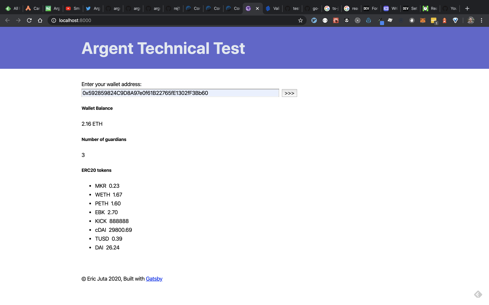

# Argent Technical Test

## Live deployment

[Netlify deployed application](https://sad-einstein-ff6d2a.netlify.com/)

## Setup

- `yarn install`

## Run Locally

- `yarn dev` [Recommended]

  OR

- `yarn build && yarn serve`

## Run tests

- `yarn test`

## Implementation

- Forked my gatsby boilerplate
- Added ts-jest
- Added typechain
- Added ethers
- Wrote lib/get-application-id.ts to fetch my blockchain application id to put into the typeform link
- Used typechain to generate a TypeScript contract factory for the GuardianManager ABI JSON file :)
- Wrote an integration spec for the GuardianManager {getGuardians, guardianCount} mainnet calls
- Wrote an integration spec for fetching the balance of the test argent wallet address
- Wrote an integration spec for fetching the ERC20 tokens of the test argent wallet address
- Added Formik
- Used useFormik React hook inside containers/ArgentForm
- Separate out the form and data into two containers
- Write a custom useEffect hook for only rendering once all async promises have resolved for fetching data
- Add address validation to display error message tied to Formik
- Add @testing-library/react
- Add unit tests for ArgentForm with error assertion

### Extra notes

- Spent ~2-3 hours on this exercise

  > Longest part was admittedly choosing how to fetch the ERC20 tokens for the Argent test wallet address and formatting that.

  > Not the best solution, ideally for performance it'd be retrieved fully from an API but I wrote data transforming code post-ERC20 Factory `decimals` call for the corresponding ERC20 token contract address to show more of my skillset.

  - `src/lib/argent-wallet.ts`

- Proud of using typechain and formik and @testing-library/react; super underused/underrated libraries

- Would/should setup eslint with airbnb config
- Would add more @testing-library/react specs given more time with jest snapshots to further behaviour test the containers
- Would also like to use cypress or playwright to test the application e2e

- Authentication wise, I could buidl a two serverless functions tied to a datastore

  1 - Asks a web3/argent user/provider to sign a time based uuid as a message persisted to a data store

  2 - POST that signature to a second serverless function that double checks the signature is either by the Argent wallet address or guardian via public address and message recovery

- Customise a design system for it using theme-ui and the tailwind config with storybook components

- Or maybe use react-native-web components with expo for cross platform goodness?

#### Preview

